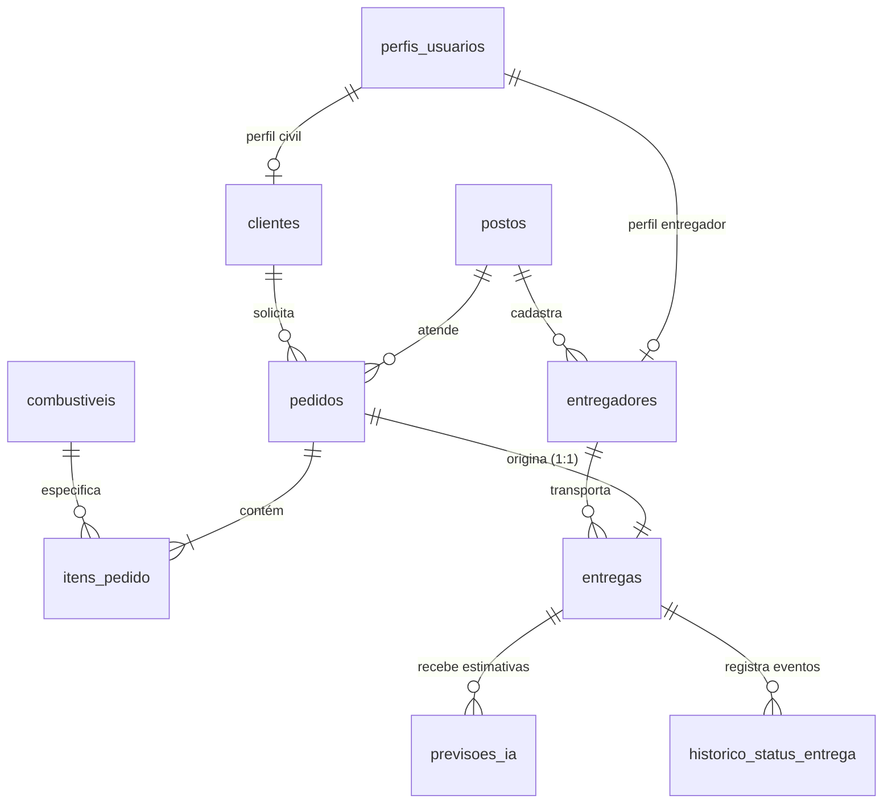

# Dicionário de Dados e Arquitetura do Banco de Dados: Fuel-Sync

Este documento descreve a modelagem relacional, constraints, índices e o dicionário de dados do banco de dados da plataforma Fuel-Sync (PostgreSQL / Supabase).

---

## 1. Visão Geral da Modelagem

O modelo de dados foi projetado para operações **B2C (consumidores civis, marinas, geradores em condomínios e chácaras)** com ciclo logístico fechado **Posto -> Cliente -> Posto (Hub-and-Spoke)**.

---

## 2. Dicionário de Dados das Tabelas

### 2.1 `perfis_usuarios`
Armazena a referência de perfil vinculada à conta autenticada no Supabase Auth (`auth.users`).

| Coluna | Tipo | Constraints | Descrição |
| :--- | :--- | :--- | :--- |
| `id` | `UUID` | `PRIMARY KEY` | Identificador do usuário emitido pelo Supabase Auth |
| `email` | `VARCHAR(150)` | `NOT NULL, UNIQUE` | E-mail corporativo ou pessoal |
| `nome` | `VARCHAR(120)` | `NOT NULL` | Nome completo do usuário |
| `role` | `VARCHAR(20)` | `NOT NULL, CHECK (cliente, posto_admin, entregador)` | Papel de acesso no sistema (RBAC) |
| `created_at` | `TIMESTAMP WITH TIME ZONE` | `DEFAULT CURRENT_TIMESTAMP` | Data e hora de criação |

---

### 2.2 `postos`
Representa os postos de abastecimento parceiros que preparam e despacham o combustível.

| Coluna | Tipo | Constraints | Descrição |
| :--- | :--- | :--- | :--- |
| `id` | `SERIAL` | `PRIMARY KEY` | Identificador sequencial do posto |
| `nome_fantasia` | `VARCHAR(150)` | `NOT NULL` | Nome comercial do posto |
| `razao_social` | `VARCHAR(150)` | | Razão social fiscal |
| `cnpj` | `VARCHAR(18)` | `NOT NULL, UNIQUE` | Cadastro Nacional da Pessoa Jurídica |
| `telefone` | `VARCHAR(20)` | `NOT NULL` | Telefone de contato operacional |
| `endereco` | `VARCHAR(255)` | `NOT NULL` | Endereço físico da base/posto |
| `latitude` | `DECIMAL(9,6)` | `NOT NULL, CHECK (-90 a 90)` | Coordenada de latitude da base |
| `longitude` | `DECIMAL(9,6)` | `NOT NULL, CHECK (-180 a 180)` | Coordenada de longitude da base |
| `tempo_medio_preparo_minutos` | `INTEGER` | `DEFAULT 12, CHECK (>= 0)` | Tempo padrão de carregamento e conferência no posto |
| `ativo` | `BOOLEAN` | `DEFAULT TRUE` | Flag de disponibilidade operacional do posto |
| `created_at` | `TIMESTAMP WITH TIME ZONE` | `DEFAULT CURRENT_TIMESTAMP` | Registro de data de criação |

---

### 2.3 `clientes`
Consumidores civis cadastrados para solicitar abastecimento fracionado.

| Coluna | Tipo | Constraints | Descrição |
| :--- | :--- | :--- | :--- |
| `id` | `SERIAL` | `PRIMARY KEY` | Identificador sequencial do cliente |
| `usuario_id` | `UUID` | `UNIQUE` | Vínculo opcional com `perfis_usuarios(id)` |
| `nome` | `VARCHAR(120)` | `NOT NULL` | Nome completo do cliente |
| `cpf` | `VARCHAR(14)` | `NOT NULL, UNIQUE` | Cadastro de Pessoa Física |
| `email` | `VARCHAR(150)` | `NOT NULL, UNIQUE` | E-mail para notificações e faturamento |
| `telefone` | `VARCHAR(20)` | `NOT NULL` | WhatsApp / Telefone para aviso de entrega |
| `endereco_padrao` | `VARCHAR(255)` | | Endereço habitual de entrega |
| `ponto_referencia_padrao` | `VARCHAR(150)` | | Exemplo: "Marina da Glória, Píer B, Vaga 14" |
| `latitude` | `DECIMAL(9,6)` | `CHECK (-90 a 90)` | Latitude padrão do local de entrega |
| `longitude` | `DECIMAL(9,6)` | `CHECK (-180 a 180)` | Longitude padrão do local de entrega |
| `created_at` | `TIMESTAMP WITH TIME ZONE` | `DEFAULT CURRENT_TIMESTAMP` | Data de cadastro |

---

### 2.4 `entregadores`
Condutores credenciados pelo posto operando veículos leves/utilitários homologados.

| Coluna | Tipo | Constraints | Descrição |
| :--- | :--- | :--- | :--- |
| `id` | `SERIAL` | `PRIMARY KEY` | Identificador sequencial do entregador |
| `usuario_id` | `UUID` | `UNIQUE` | Vínculo com a conta de autenticação |
| `posto_id` | `INTEGER` | `NOT NULL, REFERENCES postos(id)` | Posto ao qual o entregador está vinculado |
| `nome` | `VARCHAR(120)` | `NOT NULL` | Nome do condutor |
| `cpf` | `VARCHAR(14)` | `NOT NULL, UNIQUE` | CPF do condutor |
| `telefone` | `VARCHAR(20)` | `NOT NULL` | Telefone celular do entregador |
| `veiculo_descricao` | `VARCHAR(80)` | `NOT NULL` | Descrição do utilitário com tanques homologados |
| `placa` | `VARCHAR(10)` | `NOT NULL` | Placa do veículo |
| `status` | `VARCHAR(30)` | `CHECK (DISPONIVEL, EM_ROTA, INDISPONIVEL)` | Status de disponibilidade operacional |
| `ultima_latitude` | `DECIMAL(9,6)` | `CHECK (-90 a 90)` | Posição recente para monitoramento de rota |
| `ultima_longitude` | `DECIMAL(9,6)` | `CHECK (-180 a 180)` | Posição recente para monitoramento de rota |
| `ultima_posicao_em` | `TIMESTAMP WITH TIME ZONE` | | Timestamp da última coordenada registrada |
| `created_at` | `TIMESTAMP WITH TIME ZONE` | `DEFAULT CURRENT_TIMESTAMP` | Data de cadastro |

---

### 2.5 `combustiveis`
Catálogo de produtos combustíveis disponíveis para entrega civil.

| Coluna | Tipo | Constraints | Descrição |
| :--- | :--- | :--- | :--- |
| `id` | `SERIAL` | `PRIMARY KEY` | Identificador do combustível |
| `nome` | `VARCHAR(50)` | `NOT NULL, UNIQUE` | Nome comercial (ex: Gasolina Podium, Diesel Náutico S10) |
| `unidade_medida` | `VARCHAR(10)` | `NOT NULL, DEFAULT 'LITROS'` | Unidade padrão de medida |

---

### 2.6 `pedidos`
Cabeçalho das solicitações de abastecimento feitas pelos clientes civis.

| Coluna | Tipo | Constraints | Descrição |
| :--- | :--- | :--- | :--- |
| `id` | `SERIAL` | `PRIMARY KEY` | Número do pedido |
| `cliente_id` | `INTEGER` | `NOT NULL, REFERENCES clientes(id)` | Cliente solicitante |
| `posto_id` | `INTEGER` | `NOT NULL, REFERENCES postos(id)` | Posto responsável pelo fornecimento |
| `status` | `VARCHAR(30)` | `CHECK (PENDENTE, CONFIRMADO_POSTO, EM_PREPARACAO, EM_TRANSPORTE, CONCLUIDO, CANCELADO)` | Estado do pedido |
| `valor_total` | `DECIMAL(12,2)` | `NOT NULL, CHECK (>= 0)` | Valor total acumulado dos itens |
| `endereco_entrega` | `VARCHAR(255)` | `NOT NULL` | Local onde o abastecimento ocorrerá |
| `ponto_referencia` | `VARCHAR(150)` | | Píer, vaga, ramal ou condomínio |
| `tipo_local` | `VARCHAR(30)` | `CHECK (MARINA, CONDOMINIO, CHACARA, RODOVIA, RESIDENCIA, OUTRO)` | Classificação operacional do local civil |
| `instrucoes_adicionais` | `TEXT` | | Orientações de acesso para o entregador |
| `destino_latitude` | `DECIMAL(9,6)` | `NOT NULL, CHECK (-90 a 90)` | Coordenada exata do destino |
| `destino_longitude` | `DECIMAL(9,6)` | `NOT NULL, CHECK (-180 a 180)` | Coordenada exata do destino |
| `data_pedido` | `TIMESTAMP WITH TIME ZONE` | `DEFAULT CURRENT_TIMESTAMP` | Data de emissão |

---

### 2.7 `itens_pedido`
Detalhamento de volume e tipo de combustível do pedido.

| Coluna | Tipo | Constraints | Descrição |
| :--- | :--- | :--- | :--- |
| `id` | `SERIAL` | `PRIMARY KEY` | Identificador do item |
| `pedido_id` | `INTEGER` | `NOT NULL, REFERENCES pedidos(id) ON DELETE CASCADE` | Pedido correspondente |
| `combustivel_id` | `INTEGER` | `NOT NULL, REFERENCES combustiveis(id)` | Tipo de combustível solicitado |
| `quantidade_litros` | `DECIMAL(10,2)` | `NOT NULL, CHECK (> 0)` | Volume solicitado em litros |
| `valor_unitario` | `DECIMAL(8,3)` | `NOT NULL, CHECK (>= 0)` | Preço por litro praticado pelo posto |
| `subtotal` | `DECIMAL(12,2)` | `NOT NULL, CHECK (>= 0)` | Volume multiplicado pelo valor unitário |

---

### 2.8 `entregas`
Representa a execução física da entrega seguindo o ciclo Posto-Cliente-Posto.

| Coluna | Tipo | Constraints | Descrição |
| :--- | :--- | :--- | :--- |
| `id` | `SERIAL` | `PRIMARY KEY` | Identificador da entrega |
| `pedido_id` | `INTEGER` | `NOT NULL, UNIQUE, REFERENCES pedidos(id)` | Relação 1:1 com o pedido |
| `entregador_id` | `INTEGER` | `NOT NULL, REFERENCES entregadores(id)` | Condutor responsável pela viagem |
| `ordem_na_fila` | `INTEGER` | `NOT NULL, DEFAULT 1, CHECK (>= 1)` | Posição na fila de entregas do entregador |
| `status_entrega` | `VARCHAR(35)` | `CHECK (AGENDADO, EM_OUTRA_ENTREGA, PREPARANDO_POSTO, A_CAMINHO, NO_LOCAL_ABASTECENDO, RETORNANDO_AO_POSTO, CONCLUIDO, FALHA_CANCELADO)` | Etapa atual do ciclo |
| `data_inicio_preparo` | `TIMESTAMP WITH TIME ZONE` | | Início da carga no posto |
| `data_saida_posto` | `TIMESTAMP WITH TIME ZONE` | | Saída do posto rumo ao cliente |
| `data_chegada_local` | `TIMESTAMP WITH TIME ZONE` | | Chegada à marina/local |
| `data_inicio_retorno` | `TIMESTAMP WITH TIME ZONE` | | Fim do abastecimento e partida para o posto |
| `data_retorno_posto` | `TIMESTAMP WITH TIME ZONE` | | Chegada à base / conclusão do ciclo |
| `tempo_estimado_atendimento_min` | `INTEGER` | `DEFAULT 20, CHECK (>= 0)` | Tempo previsto para operação no local |

---

### 2.9 `previsoes_ia`
Registros das estimativas inteligentes geradas pelo motor preditivo de IA.

| Coluna | Tipo | Constraints | Descrição |
| :--- | :--- | :--- | :--- |
| `id` | `BIGSERIAL` | `PRIMARY KEY` | Identificador da previsão |
| `entrega_id` | `INTEGER` | `NOT NULL, REFERENCES entregas(id) ON DELETE CASCADE` | Entrega avaliada |
| `eta_previsto` | `TIMESTAMP WITH TIME ZONE` | `NOT NULL` | Horário estimado de chegada ao local do cliente |
| `tempo_espera_liberacao_minutos` | `INTEGER` | `DEFAULT 0, CHECK (>= 0)` | Tempo restante da entrega anterior + retorno ao posto |
| `tempo_preparo_posto_minutos` | `INTEGER` | `DEFAULT 12, CHECK (>= 0)` | Tempo de carregamento deste pedido no posto |
| `tempo_viagem_cliente_minutos` | `INTEGER` | `DEFAULT 0, CHECK (>= 0)` | Deslocamento rodoviário do posto até o cliente |
| `confianca_score` | `DECIMAL(5,4)` | `CHECK (0 a 1)` | Nível de precisão da estimativa |
| `risco_atraso` | `BOOLEAN` | `DEFAULT FALSE` | Indicador de risco iminente de atraso |
| `fator_principal_risco` | `VARCHAR(100)` | | Fator causal (ex: `DEMORA_PARADA_ANTERIOR`, `TRANSITO`) |
| `mensagem_humanizada` | `TEXT` | `NOT NULL` | Texto explicativo claro exibido no app civil |
| `criado_em` | `TIMESTAMP WITH TIME ZONE` | `DEFAULT CURRENT_TIMESTAMP` | Data do cálculo |

---

### 2.10 `historico_status_entrega`
Registro imutável de auditoria de cada evento de avanço ou alteração da entrega.

| Coluna | Tipo | Constraints | Descrição |
| :--- | :--- | :--- | :--- |
| `id` | `BIGSERIAL` | `PRIMARY KEY` | Identificador sequencial do log |
| `entrega_id` | `INTEGER` | `NOT NULL, REFERENCES entregas(id) ON DELETE CASCADE` | Entrega relacionada |
| `status_anterior` | `VARCHAR(35)` | | Status prévio à transição |
| `status_novo` | `VARCHAR(35)` | `NOT NULL` | Novo status estabelecido |
| `descricao_motivo` | `VARCHAR(255)` | | Justificativa ou detalhe do evento |
| `origem_alteracao` | `VARCHAR(30)` | `CHECK (ENTREGADOR_APP, POSTO_WEB, SISTEMA_IA, CLIENTE_APP)` | Canal que acionou a mudança |
| `latitude_momento` | `DECIMAL(9,6)` | `CHECK (-90 a 90)` | Coordenada no instante do check-in |
| `longitude_momento` | `DECIMAL(9,6)` | `CHECK (-180 a 180)` | Coordenada no instante do check-in |
| `criado_em` | `TIMESTAMP WITH TIME ZONE` | `NOT NULL, DEFAULT CURRENT_TIMESTAMP` | Momento exato da transição |

---

## 3. Índices de Otimização de Consultas

1. `idx_entregas_fila`: `(entregador_id, status_entrega, ordem_na_fila)`
   - Otimiza a recuperação da fila ativa do entregador e a automação do próximo cliente a ser preparado.
2. `idx_previsoes_entrega`: `(entrega_id, criado_em DESC)`
   - Otimiza a consulta imediata da previsão de ETA mais recente para exibição no aplicativo do cliente civil.
3. `idx_historico_entrega`: `(entrega_id, criado_em DESC)`
   - Otimiza a linha do tempo e auditoria da entrega.
