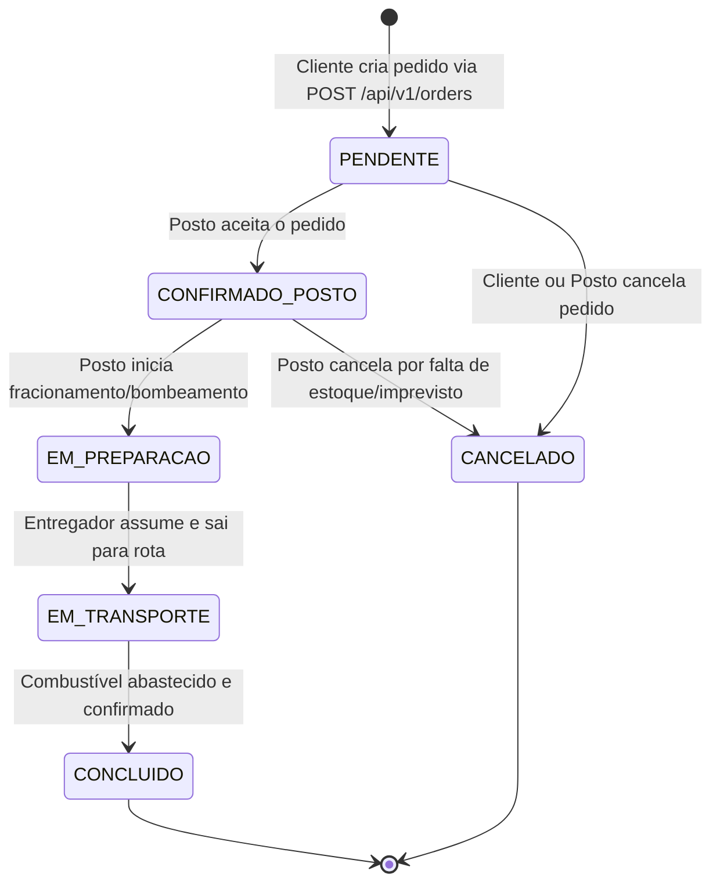
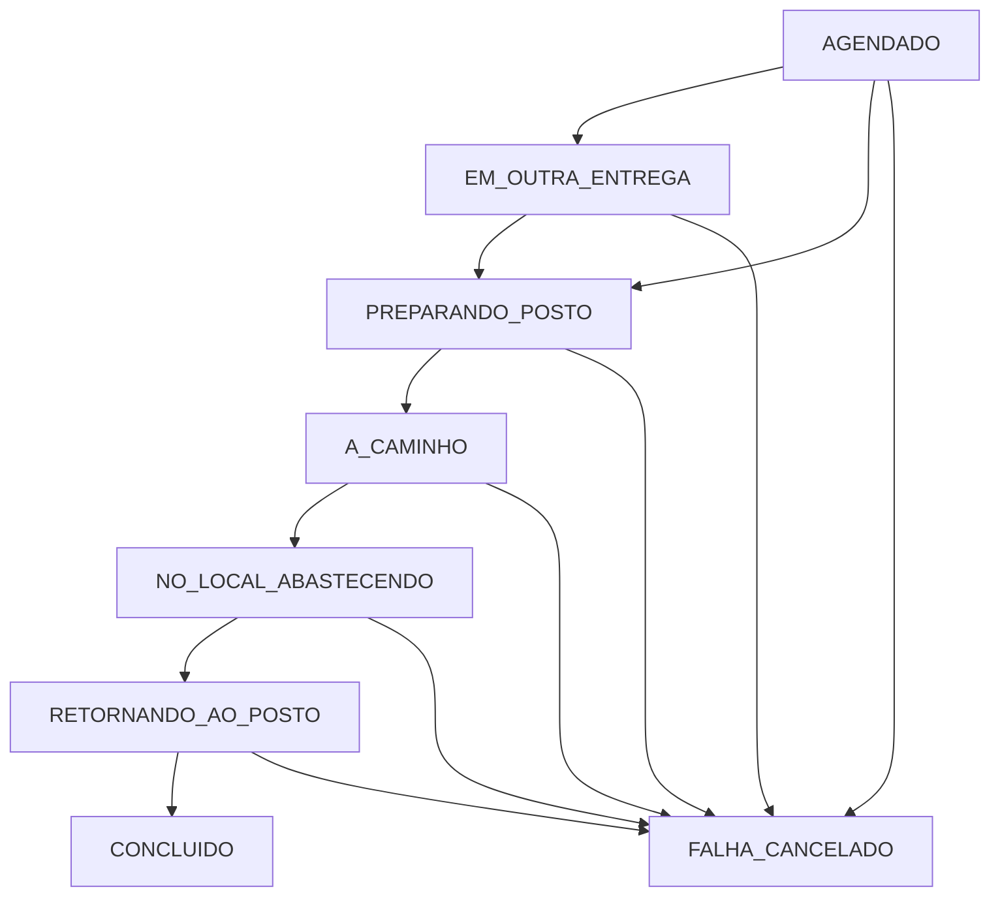
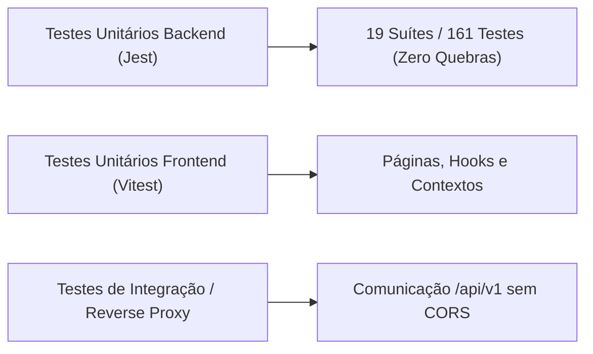

# ESPECIFICAÇÃO TÉCNICA: INTEGRAÇÃO FRONTEND-BACKEND (TASK DE INTEGRAÇÃO)

---

## 1. Visão Geral e Objetivo

- **Objetivo Principal:** Implementar a integração completa do Frontend (React/Vite) com o Backend (Node.js/Express/Supabase) da aplicação **FuelSync** na branch `feature/integracao-front-back`.
- **Contexto da Aplicação:** A FuelSync é uma plataforma de abastecimento fracionado e logística sob demanda para consumidores civis B2C (embarcações em marinas, geradores em condomínios e chácaras) e frotas terrestres, conectando clientes, postos de combustíveis credenciados e entregadores em um ciclo logístico estruturado (*Hub-and-Spoke*: Posto $\to$ Cliente $\to$ Posto).
- **Diagnóstico do Estado Atual:**
  1. O frontend possui protótipos de tela com formulários e visualização, porém todos os dados estão **mockados** em memória via `useState` local.
  2. Existe um desvio no roteamento em `frontend/src/routes/AppRoutes.jsx`, onde a exportação temporária de `AppRoutesTest` contorna o `<ProtectedRoute>`, fazendo com que a Homepage e as páginas internas fiquem públicas e o usuário continue na tela mesmo após clicar em Logout.
  3. O backend já possui 19 suítes e 161 testes automatizados (100% aprovados) cobrindo autenticação, RBAC, catálogo, postos, entregadores, pedidos civis e ciclo de entregas sob o prefixo `/api/v1`.
  4. Há necessidade de refinar o design visual existente para aderir estritamente a um padrão **Institucional / Enterprise / ERP corporativo**, expurgando anti-padrões de IA e inconsistências visuais.
  5. É necessário formalizar o controle multi-tenant de postos para administradores locais e criar o suporte ao perfil de **Administrador Geral** (`admin_geral`).

---

## 2. Diretrizes Estritas de Design e Identidade Visual (Institucional / Enterprise)

A interface existente **não deve ser 100% descartada ou refeita do zero**, mas sim refinada incrementalmente através de ajustes de paleta, tipografia, ritmo visual, espaçamento e densidade de informação corporativa.

### 2.1 Princípios Gerais
- **Evolução Incremental:** Preserve a estrutura de layout e a arquitetura de páginas existente, aplicando ajustes pontuais em classes CSS/Tailwind, alinhamentos e componentes.
- **Identidade Corporativa e Sóbria:** Interface com aspecto profissional de software de missão crítica (logística de combustíveis, telemetria e faturamento), comparável a sistemas governamentais, portuários ou ERPs industriais.

### 2.2 Tipografia e Escala
- **Fonte Oficial:** Importar e utilizar **"Poppins"**, sans-serif via Google Fonts (pesos: 300, 400, 500, 600, 700).
- **Escala Tipográfica Contida:**
  - Texto base / corpo: `14px` (`text-sm`) a `15px` / `16px` (`text-base`).
  - Metadados, legendas e rótulos de tabela: `11px` a `12px` (`text-xs`).
  - Títulos de seção / cartões: `16px` a `18px` (`text-base` / `text-lg`), peso semibold (600).
  - Títulos de página / cabeçalhos principais: máximo `24px` a `28px` (`text-2xl`), evitando fontes gigantes desnecessárias.

### 2.3 Hierarquia Visual e Paleta de Cores
- **Contraste Neutro e Equilibrado:** Estabeleça hierarquia através de pesos de fonte e escala de tons neutros:
  - Texto principal / títulos: Cinza escuro `#111827` (Tailwind `slate-900` / `gray-900`).
  - Texto secundário / apoios: Cinza médio `#4B5563` (`gray-600`) ou `#6B7280` (`gray-500`).
  - Bordas de divisão estrutural: `#E5E7EB` (`gray-200`) ou `#D1D5DB` (`gray-300`).
  - Fundos de aplicação: Tons claros e limpos `#F9FAFB` (`gray-50`) ou `#F3F4F6` (`gray-100`).
- **Cor Primária Corporativa:** Azul institucional sólido (ex: `#1E40AF` / `#2563EB`) ou azul-marinho profundo.
- **Cores Semânticas Funcionais:**
  - Sucesso / Concluído: Verde sóbrio `#166534` (fundo `#DCFCE7`, borda `#BBF7D0`).
  - Alerta / Pendente / Preparação: Âmbar sóbrio `#854D0E` (fundo `#FEF9C3`, borda `#FEF08A`).
  - Erro / Cancelado / Falha: Vermelho sóbrio `#991B1B` (fundo `#FEE2E2`, borda `#FECACA`).
  - Informação / Em trânsito: Azul clássico `#1E40AF` (fundo `#DBEAFE`, borda `#BFDBFE`).

### 2.4 Anti-padrões de IA (Proibições Estritas)
1. **Sem Gradientes Decorativos:** Proibido o uso de gradientes lineares ou radiais em fundos de tela, cartões, textos ou botões. Utilize cores sólidas, neutras e sóbrias.
2. **Sem Efeito "Glassmorphism" ou Neon:** Proibido o uso de `backdrop-blur` excessivo, sombras coloridas/brilhantes (ex: `shadow-purple-500/20`), ou bordas translúcidas reluzentes.
3. **Bordas e Arredondamento Contidos:** Limite o raio de borda a valores sutis (máximo `border-radius: 6px` a `8px` — classes `rounded-md` ou `rounded-lg`). Proibido o uso de `rounded-2xl`, `rounded-3xl` ou `rounded-full` em cartões e containers de conteúdo.
4. **Sombras Funcionais Mínimas:** Empregue elevação mínima (ex: `box-shadow: 0 1px 2px 0 rgba(0, 0, 0, 0.05)` — classe `shadow-sm`). A delimitação de blocos deve ser feita prioritariamente por bordas finas sólidas (`1px solid #E5E7EB`) e espaçamento em branco.
5. **Zero Iconografia Decorativa:** Ícones (`lucide-react`) são restritos a elementos funcionais (ações de clique, ordenação, botões de expandir/fechar) ou indicadores críticos de status operacional. Não insira ícones ilustrativos ao lado de cada título de seção, cabeçalho de tabela ou card genérico.
6. **Densidade de Dados Corporativa:** Evite cartões inflados com áreas vazias excessivas. Adote densidade compatível com painéis de gestão e faturamento (tabelas compactas com divisórias claras, dados tabulares alinhados e formulários objetivos).

### 2.5 Responsividade Total (100% Mobile-Friendly & Adaptive)
- **Suporte Multidispositivo:** Legibilidade e usabilidade garantidas de `320px`/`360px` (smartphones compactos) a `1440px+` (monitores corporativos).
- **Sem Overflow Horizontal Involuntário:** O body e a viewport devem conter `overflow-x: hidden`. Larguras de tela devem ser fluidas (`w-full`, `max-w-7xl`, `max-w-4xl`), sem dimensões fixas em pixels rígidos.
- **Tabelas Adaptáveis:** Tabelas de dados e faturamento devem contar com container com scroll horizontal dedicado (`overflow-x: auto`) exclusivo do bloco ou converter-se em lista de cartões compactos em telas menores que `768px`.
- **Navegação Mobile:** Menus e barras laterais (sidebar) devem colapsar elegantemente para um menu hambúrguer / drawer superior no mobile sem quebrar o grid da página.
- **Alvos de Toque Acessíveis:** Botões, inputs, selects e elementos interativos devem possuir altura mínima de `40px` a `44px` para acionamento por toque.

---

## 3. Correção de Roteamento, Autenticação e Sessão (Bug da Homepage)

### 3.1 Causa Raiz Identificada
No arquivo [`frontend/src/routes/AppRoutes.jsx`](file:///home/joaomiguel/dev/fuel-sync/frontend/src/routes/AppRoutes.jsx), as rotas oficiais protegidas foram comentadas e substituídas pela exportação de `AppRoutesTest`, que expunha todas as rotas diretamente sem o wrapper `<ProtectedRoute>`. Por essa razão, a aplicação não verificava token e o usuário permanecia na tela principal após clicar em Logout.

### 3.2 Correções Obrigatórias
1. **Restaurar `<ProtectedRoute>`:** Reativar a proteção em todas as rotas operacionais (`/`, `/perfil`, `/comprar`, `/rastreio`, `/enderecos`, `/admin/*`, `/posto/*`).
2. **Criar `<PublicOnlyRoute>`:** As rotas `/login` e `/cadastro` devem redirecionar automaticamente para `/` se o usuário já possuir token ativo e válido.
3. **Fluxo Síncrono de Logout:**
   - O método `logout()` do [`AuthContext`](file:///home/joaomiguel/dev/fuel-sync/frontend/src/context/AuthContext.js) deve remover `fuel_sync_token` e `fuel_sync_user` do `localStorage`.
   - Redirecionar imediatamente para `/login` via `useNavigate()`.
4. **Renovação Transparente de Token (Silent Refresh via Interceptor Axios) & Resiliência a 401:**
   - **Problema de UX e Anti-padrão:** Deslogar o usuário sumariamente no primeiro erro 401 anula a razão de existir do `refreshToken`, destrói formulários em preenchimento (ex: compras complexas de combustível com múltiplos itens) e interrompe o acompanhamento contínuo de entregas em tempo real.
   - **Mecanismo de Renovação Automática (Silent Token Refresh):**
     - O [`AuthContext`](file:///home/joaomiguel/dev/fuel-sync/frontend/src/context/AuthContext.js) deve persistir tanto o `accessToken` (`fuel_sync_token`) quanto o `refreshToken` (`fuel_sync_refresh_token`) no `localStorage`.
     - O interceptor de resposta em [`frontend/src/services/api.js`](file:///home/joaomiguel/dev/fuel-sync/frontend/src/services/api.js) deve gerenciar uma fila de espera (`failedQueue`) e uma flag de bloqueio (`isRefreshing`):
       1. Se uma chamada autenticada retornar `401 Unauthorized`:
          - Caso a rota seja o próprio login (`/auth/login`) ou refresh (`/auth/refresh`), rejeita imediatamente sem tentar renovação.
          - Se a requisição já tiver a flag `_retry: true`, significa que o `refreshToken` expirou ou foi invalidado no servidor: **somente neste momento crítico** o interceptor limpa o `localStorage` e direciona para `/login` (preservando a rota no `state.from`).
          - Se `_retry` não existir, define `originalRequest._retry = true`.
       2. Caso já haja uma renovação em andamento (`isRefreshing = true`), a requisição original é empurrada para uma fila de promessas pendentes (`failedQueue`).
       3. Caso seja o primeiro 401, define `isRefreshing = true` e dispara `POST /api/v1/auth/refresh` enviando o `refreshToken`.
       4. **Sucesso no Refresh:**
          - Salva o novo par de tokens (`accessToken` e `refreshToken`) no `localStorage`.
          - Atualiza os cabeçalhos padrão do Axios: `api.defaults.headers.common['Authorization'] = 'Bearer ' + newAccessToken`.
          - Atualiza o header da requisição original e a reexecuta de forma imperceptível.
          - Resolve todas as requisições retidas na `failedQueue` com o novo token.
          - Define `isRefreshing = false`.
       5. **Falha no Refresh (Refresh Token Expirado/Revogado):**
          - Rejeita todas as requisições enfileiradas na `failedQueue`.
          - Limpa `fuel_sync_token`, `fuel_sync_refresh_token` e `fuel_sync_user`.
          - Redireciona para `/login`.
          - Define `isRefreshing = false`.
   - **Resultado Prático:** Operadores e clientes navegam e operam continuamente sem jamais serem expulsos da sessão enquanto seu `refreshToken` for válido.
5. **Roteamento Baseado em Papéis (RBAC no Frontend):**
   - Implementar componente `<RoleRoute allowedRoles={['cliente', 'posto_admin', 'admin_geral']}>` para impedir que clientes acessem URLs administrativas ou que administradores façam pedidos civis por engano.

---

## 4. Auditoria e Validação das Máquinas de Estados

O backend já implementa **duas máquinas de estado formais**. O frontend atual utiliza constantes descoladas da realidade da API (ex: `STATUS_PEDIDO` com `ROTA`, `TRANSITO`, `ENTREGUE`). A integração deve alinhar a UI 100% aos enums oficiais do backend.

### 4.1 Máquina de Estados do Pedido Civil (`OrderStatus`)
Arquivo de referência: [`src/common/constants/enums.js`](file:///home/joaomiguel/dev/fuel-sync/src/common/constants/enums.js).



- **Regra de Cancelamento pelo Cliente:** O consumidor civil só tem permissão para cancelar pedidos enquanto o status for estritamente `PENDENTE`. Após entrar em `CONFIRMADO_POSTO` ou `EM_PREPARACAO`, a ação é bloqueada no backend (`AppError 400`). A interface deve desabilitar ou ocultar o botão de cancelamento nesses casos.

### 4.2 Máquina de Estados do Ciclo Logístico da Entrega (`DeliveryStatus`)
Arquivo de referência: [`src/common/entities/validations.js`](file:///home/joaomiguel/dev/fuel-sync/src/common/entities/validations.js) (`allowedTransitions` e `validateDeliveryTransition`).



- **Alinhamento na Tela de Rastreio (`OrderTrackingPage.jsx`):** A barra de progresso / timeline de entrega deve refletir estes estados reais e exibir as estimativas de tempo e risco fornecidas pela tabela `previsoes_ia` (ETA previsto, tempo de preparo, tempo de viagem, score de confiança e mensagem humanizada).

---

## 5. Arquitetura de Permissões (RBAC) e Modelo Multi-tenant de Postos

### 5.1 Novos Papéis no Sistema
No backend (`src/common/constants/enums.js`), o enum `UserRoles` deve contemplar:
- `CLIENTE: 'cliente'` (Consumidor civil; pessoa física ou comandante).
- `POSTO_ADMIN: 'posto_admin'` (Administrador do posto específico).
- `ENTREGADOR: 'entregador'` (Condutor credenciado).
- `ADMIN_GERAL: 'admin_geral'` (Administrador global da plataforma FuelSync).

### 5.2 Tabela de Associação: Posto-Administrador (`posto_administradores`)
Para atender ao requisito de que **"um administrador de um posto só pode fazer alterações nos postos em que é administrador"**, deve ser criada a tabela de vinculação relacional no Supabase / PostgreSQL:

```sql
-- DDL de Controle de Acesso Multi-tenant por Posto
CREATE TABLE IF NOT EXISTS posto_administradores (
    id SERIAL PRIMARY KEY,
    usuario_id UUID NOT NULL REFERENCES perfis_usuarios(id) ON DELETE CASCADE,
    posto_id INTEGER NOT NULL REFERENCES postos(id) ON DELETE CASCADE,
    created_at TIMESTAMP WITH TIME ZONE DEFAULT CURRENT_TIMESTAMP,
    UNIQUE (usuario_id, posto_id)
);

CREATE INDEX IF NOT EXISTS idx_posto_admin_usuario ON posto_administradores (usuario_id);
CREATE INDEX IF NOT EXISTS idx_posto_admin_posto ON posto_administradores (posto_id);
```

### 5.3 Regras de Autorização no Backend & Frontend
1. **`posto_admin`:**
   - Ao logar, a API identifica os `posto_id` aos quais o usuário está vinculado.
   - Só pode visualizar e gerenciar pedidos cujo `posto_id` corresponda ao seu vínculo.
   - Só pode cadastrar e vincular entregadores ao seu próprio posto.
   - Só pode alterar preço e estoque do catálogo dos postos que administra.
   - Não pode criar novos postos ou editar postos de terceiros.
2. **`admin_geral`:**
   - Possui acesso total e irrestrito a todos os postos, pedidos, entregadores e relatórios.
   - Possui exclusividade para cadastrar novos postos de combustível na plataforma (`POST /api/v1/stations`).
   - Pode vincular administradores a postos através da tabela `posto_administradores`.
   - Pode cadastrar entregadores em qualquer posto do sistema.

### 5.4 Modelo Relacional de Preços por Posto (`posto_combustiveis` e `historico_precos_combustivel`)

Cada posto de combustível parceiro possui autonomia comercial, custos de logística portuária/rodoviária e margens operacionais próprias. Portanto, **os preços por litro não são globais**, devendo ser **obrigatoriamente preenchidos e atualizados pelo administrador de cada posto (`posto_admin`)**.

Para registrar e controlar os preços vigentes e o histórico de reajustes, devem ser criadas duas tabelas relacionais no banco de dados:

#### 5.4.1 Tabela de Catálogo e Preços Vigentes do Posto (`posto_combustiveis`)
Relaciona o posto aos combustíveis que ele efetivamente comercializa, registrando o preço atual por litro e o estoque operacional:

```sql
-- DDL de Catálogo, Preço e Estoque por Posto
CREATE TABLE IF NOT EXISTS posto_combustiveis (
    id SERIAL PRIMARY KEY,
    posto_id INTEGER NOT NULL REFERENCES postos(id) ON DELETE CASCADE,
    combustivel_id INTEGER NOT NULL REFERENCES combustiveis(id) ON DELETE RESTRICT,
    preco_litro DECIMAL(8,3) NOT NULL CHECK (preco_litro > 0),
    estoque_litros DECIMAL(12,2) DEFAULT 0 CHECK (estoque_litros >= 0),
    disponivel BOOLEAN DEFAULT TRUE,
    atualizado_em TIMESTAMP WITH TIME ZONE DEFAULT CURRENT_TIMESTAMP,
    atualizado_por UUID REFERENCES perfis_usuarios(id) ON DELETE SET NULL,
    UNIQUE (posto_id, combustivel_id)
);

CREATE INDEX IF NOT EXISTS idx_posto_combustiveis_posto ON posto_combustiveis (posto_id, disponivel);
CREATE INDEX IF NOT EXISTS idx_posto_combustiveis_combustivel ON posto_combustiveis (combustivel_id);
```

#### 5.4.2 Tabela de Auditoria e Histórico de Preços (`historico_precos_combustivel`) com Trigger
Armazena a trilha imutável de todas as alterações tarifárias para conciliação financeira, auditoria de pedidos passados e inteligência preditiva de preços:

```sql
-- DDL de Histórico e Auditoria de Reajustes de Preços
CREATE TABLE IF NOT EXISTS historico_precos_combustivel (
    id BIGSERIAL PRIMARY KEY,
    posto_combustivel_id INTEGER NOT NULL REFERENCES posto_combustiveis(id) ON DELETE CASCADE,
    posto_id INTEGER NOT NULL REFERENCES postos(id) ON DELETE CASCADE,
    combustivel_id INTEGER NOT NULL REFERENCES combustiveis(id) ON DELETE RESTRICT,
    preco_anterior DECIMAL(8,3),
    preco_novo DECIMAL(8,3) NOT NULL CHECK (preco_novo > 0),
    alterado_em TIMESTAMP WITH TIME ZONE DEFAULT CURRENT_TIMESTAMP,
    alterado_por UUID REFERENCES perfis_usuarios(id) ON DELETE SET NULL
);

CREATE INDEX IF NOT EXISTS idx_historico_precos_posto ON historico_precos_combustivel (posto_id, combustivel_id, alterado_em DESC);

-- Trigger Function para auditoria automática de reajuste de preços
CREATE OR REPLACE FUNCTION trg_fn_log_historico_preco()
RETURNS TRIGGER AS $$
BEGIN
    IF (TG_OP = 'INSERT') OR (TG_OP = 'UPDATE' AND OLD.preco_litro IS DISTINCT FROM NEW.preco_litro) THEN
        INSERT INTO historico_precos_combustivel (
            posto_combustivel_id,
            posto_id,
            combustivel_id,
            preco_anterior,
            preco_novo,
            alterado_em,
            alterado_por
        ) VALUES (
            NEW.id,
            NEW.posto_id,
            NEW.combustivel_id,
            CASE WHEN TG_OP = 'INSERT' THEN NULL ELSE OLD.preco_litro END,
            NEW.preco_litro,
            CURRENT_TIMESTAMP,
            NEW.atualizado_por
        );
    END IF;
    RETURN NEW;
END;
$$ LANGUAGE plpgsql;

-- Trigger acionada após INSERT ou UPDATE de preco_litro em posto_combustiveis
DROP TRIGGER IF EXISTS trg_audit_preco_combustivel ON posto_combustiveis;
CREATE TRIGGER trg_audit_preco_combustivel
AFTER INSERT OR UPDATE OF preco_litro ON posto_combustiveis
FOR EACH ROW
EXECUTE FUNCTION trg_fn_log_historico_preco();
```

#### 5.4.3 Regras de Negócio e Validações de Preço:
1. **Preenchimento Mandatório pelo `posto_admin`:**
   - O administrador do posto é a única entidade autorizada a definir e alterar o preço (`preco_litro`) e o estoque dos combustíveis de sua respectiva base operacional.
   - O backend deve validar se o `usuario_id` autenticado possui vínculo ativo em `posto_administradores` para o `posto_id` informado antes de autorizar qualquer inserção ou alteração de preço.
2. **Integridade de Compra B2C:**
   - Na tela de compra (`/comprar`), após o cliente escolher o posto de abastecimento, a aplicação carrega estritamente os combustíveis cadastrados e disponíveis naquele posto (`disponivel = true` e `estoque_litros > 0`) com seus respectivos `preco_litro`.
   - Ao submeter o pedido (`POST /api/v1/orders`), o backend valida se o `valor_unitario` de cada item corresponde com fidelidade ao `preco_litro` vigente em `posto_combustiveis`, recalculando os subtotais no servidor para impedir manipulações de preço no frontend.
3. **Auditoria Automatizada via Trigger do PostgreSQL:**
   - A persistência em `historico_precos_combustivel` é disparada **exclusivamente por Trigger nativa do PostgreSQL** (`trg_audit_preco_combustivel`), sem depender de inserts manuais no código da aplicação.
   - Essa abordagem blinda o sistema contra falhas humanas (esquecimento de insert no service), garante atomicidade transacional e assegura conformidade de auditoria em reajustes via API, importações em lote (batch) ou scripts de carga.

#### 5.4.4 Execução de Migrações no Ambiente de Desenvolvimento e Docker
1. **Comando Exato para Execução:**
   - As migrações devem ser executadas através do script de runner automatizado:
     ```bash
     npm run migrate
     ```
   - *Alternativa direta via psql:*
     ```bash
     psql "$DATABASE_URL" -f database/migrations/002_station_pricing_and_multi_tenant.sql
     ```
   - *Alternativa via Supabase Dashboard:* Execução direta do conteúdo SQL no SQL Editor do projeto Supabase.
2. **Ordem de Subida no Docker:**
   - Antes de iniciar os containers de desenvolvimento com `docker compose up`, o comando `npm run migrate` deve ser executado no host, ou incluído como etapa preliminar no script de inicialização do container backend (`npm run migrate && npm start`).
3. **Estratégia de Testes (Regressão Zero e Isolamento):**
   - As suítes de teste de unidade e integração do Jest utilizam mocks do cliente Supabase (`jest.mock('../../config/supabaseClient')`), garantindo testes rápidos, determinísticos e sem dependência de banco de dados real ativo durante a esteira de CI/CD. O banco real recebe as migrações para suporte ao desenvolvimento e produção.

---

## 6. Mapeamento Detalhado de Páginas, Telas e Integração de APIs

Todas as telas listadas abaixo devem substituir integralmente os dados mockados por chamadas HTTP reais à API via Axios / TanStack Query, tratando estados de **Carregamento (Loading)**, **Erro (Error Alert)** e **Vazio (Empty State)**.

---

### 6.1 Módulos Públicos e de Autenticação

#### 6.1.1 Página de Login (`/login`)
- **Arquivo:** [`frontend/src/pages/auth/LoginPage.jsx`](file:///home/joaomiguel/dev/fuel-sync/frontend/src/pages/auth/LoginPage.jsx).
- **Endpoint Consumido:** `POST /api/v1/auth/login`.
- **Payload de Envio:**
  ```json
  { "email": "usuario@exemplo.com", "password": "senhaSegura123" }
  ```
- **Resposta Sucesso (200):**
  ```json
  {
    "accessToken": "jwt_token...",
    "refreshToken": "refresh_token...",
    "user": { "id": "uuid", "email": "...", "role": "cliente|posto_admin|admin_geral", "name": "..." }
  }
  ```
- **Comportamento:** Armazena token e usuário no `localStorage`, atualiza o `AuthContext` e redireciona dinamicamente:
  - `cliente` $\to$ `/` (Home do cliente).
  - `posto_admin` $\to$ `/posto/dashboard` (Painel do posto).
  - `admin_geral` $\to$ `/admin/postos` (Painel geral).

#### 6.1.2 Página de Cadastro (`/cadastro`)
- **Arquivo:** [`frontend/src/pages/auth/RegisterPage.jsx`](file:///home/joaomiguel/dev/fuel-sync/frontend/src/pages/auth/RegisterPage.jsx).
- **Endpoint Consumido:** `POST /api/v1/auth/signup/customer`.
- **Payload de Envio:**
  ```json
  {
    "name": "Carlos Silva",
    "email": "carlos@marina.com",
    "password": "senhaSegura123",
    "cpf": "123.456.789-00",
    "phone": "(11) 98765-4321"
  }
  ```
- **Regras:** Validação prévia de CPF válido via algoritmo módulo 11 e senha mínima de 6 caracteres. Após sucesso (201), efetua login automático ou redireciona para `/login` com mensagem de sucesso.

#### 6.1.3 Endpoint de Renovação Transparente de Sessão (`POST /api/v1/auth/refresh`)
- **Objetivo:** Renovar o `accessToken` expirado de forma assíncrona utilizando o `refreshToken`, sem intervenção do usuário e sem recarregar a tela.
- **Payload de Envio:**
  ```json
  { "refreshToken": "jwt_refresh_token_string..." }
  ```
- **Processamento no Backend:** Chama `supabase.auth.refreshSession({ refresh_token: refreshToken })` no módulo de autenticação.
- **Resposta Sucesso (200):**
  ```json
  {
    "accessToken": "new_jwt_access_token...",
    "refreshToken": "new_jwt_refresh_token...",
    "user": { "id": "uuid", "email": "...", "role": "cliente|posto_admin|admin_geral", "name": "..." }
  }
  ```
- **Resposta Erro (401):**
  ```json
  { "error": "Sessão expirada ou refresh token inválido." }
  ```

---

### 6.2 Páginas do Cliente (`role: 'cliente'`)

#### 6.2.1 Homepage do Cliente (`/`)
- **Arquivo:** [`frontend/src/pages/HomePage.jsx`](file:///home/joaomiguel/dev/fuel-sync/frontend/src/pages/HomePage.jsx).
- **Objetivo:** Hub de acesso rápido com cartões institucionais, status da sessão, dados cadastrais e atalhos diretos para *Comprar Combustível*, *Meus Pedidos* e *Endereços/Locais de Entrega*.
- **Ações:** Exibe resumo do último pedido ativo em andamento (se houver) e botão de Logout que desloga e redireciona para `/login`.

#### 6.2.2 Tela de Perfil e Dados Pessoais (`/perfil`)
- **Objetivo:** Permite ao consumidor civil completar ou atualizar seus dados cadastrais (vínculo entre `perfis_usuarios` e tabela `clientes`).
- **Endpoints Consumidos:**
  - Buscar dados atuais: `GET /customers` ou `GET /customers/:id`.
  - Atualizar perfil: `PUT /customers/:id`.
- **Campos:** Nome completo, CPF (somente leitura após validação), E-mail, Telefone/WhatsApp, Endereço Padrão e Ponto de Referência Padrão (ex: "Marina da Glória, Píer B, Vaga 14").

#### 6.2.3 Tela de Gestão de Endereços e Locais de Abastecimento (`/enderecos`)
- **Arquivo:** [`frontend/src/pages/EnderecosPage.jsx`](file:///home/joaomiguel/dev/fuel-sync/frontend/src/pages/EnderecosPage.jsx).
- **Objetivo:** Cadastrar e gerenciar pontos frequentes de entrega para abastecimento marítimo e civil fracionado.
- **Campos Obrigatórios:**
  - Apelido do local (ex: "Lancha Vaga 12 - Marina Imperial", "Gerador Bloco A").
  - Tipo de Local (`tipo_local`): `MARINA`, `CONDOMINIO`, `CHACARA`, `RODOVIA`, `RESIDENCIA`, `OUTRO`.
  - Endereço / Píer / Logradouro.
  - Ponto de referência detalhado (essencial para localização náutica).
  - Coordenadas geográficas (Latitude e Longitude terrestres válidas).
  - Nome do responsável no local e telefone de contato para recebimento.

#### 6.2.4 Tela de Solicitação de Abastecimento / Compra (`/comprar`)
- **Arquivo:** [`frontend/src/pages/ComprarCombustivelPage.jsx`](file:///home/joaomiguel/dev/fuel-sync/frontend/src/pages/ComprarCombustivelPage.jsx).
- **Objetivo:** Montagem e envio de pedidos de combustível B2C com cálculo financeiro garantido pelo servidor e preços dinâmicos por posto.
- **Fluxo de Integração e Endpoints Consumidos:**
  1. *Seleção do Posto Parceiro:* `GET /api/v1/stations` (lista postos ativos com telefone, endereço e tempo de preparo).
  2. *Carregamento dos Preços do Posto Selecionado:* `GET /api/v1/stations/:stationId/fuels` (retorna exclusivamente os combustíveis com os preços por litro preenchidos pelo administrador daquele posto em `posto_combustiveis`).
  3. *Submissão do Pedido:* `POST /api/v1/orders`.
- **Validação de Preço e Integridade Financeira:**
  - O cliente escolhe o posto de abastecimento e visualiza o valor por litro (`preco_litro`) preenchido pelo administrador daquele posto.
  - Ao digitar a litragem desejada, o frontend exibe a prévia do cálculo financeiro em tempo real ($\text{quantidade\_litros} \times \text{preco\_litro}$).
  - No backend, a API revalida se o `valor_unitario` de cada item bate estritamente com o `preco_litro` ativo do posto em `posto_combustiveis`, recalculando os subtotais no servidor para impedir qualquer manipulação de preço no frontend.
  - O backend deve normalizar o subtotal arredondando para duas casas decimais no padrão bancário (Half-Up), ex: Math.round((quantidade * preco + Number.EPSILON) * 100) / 100, evitando rejeições por discrepância de centavos devidas ao IEEE 754.
- **Contrato Estrito de Envio (`POST /api/v1/orders`):**
  ```json
  {
    "posto_id": 1,
    "endereco_entrega": "Av. Infante Dom Henrique, Marina da Glória",
    "ponto_referencia": "Píer B, Vaga 14 - Lancha Marlin",
    "tipo_local": "MARINA",
    "instrucoes_adicionais": "Ligar ao chegar na portaria da marina para liberação do portão náutico",
    "destino_latitude": -22.920800,
    "destino_longitude": -43.172900,
    "itens": [
      {
        "combustivel_id": 3,
        "quantidade_litros": 200.0,
        "valor_unitario": 6.89
      }
    ]
  }
  ```
- **Feedback na UI:** Alerta de validação de campos obrigatórios, bloqueio de submissão duplicada com spinner de loading e redirecionamento para a tela de acompanhamento com o `pedido_id` gerado.

#### 6.2.5 Tela de Acompanhamento e Rastreio de Pedidos (`/rastreio` ou `/pedidos/:id`)
- **Arquivo:** [`frontend/src/pages/OrderTrackingPage.jsx`](file:///home/joaomiguel/dev/fuel-sync/frontend/src/pages/OrderTrackingPage.jsx).
- **Endpoints Consumidos:**
  - Listar pedidos do cliente: `GET /api/v1/orders`.
  - Detalhes do pedido específico: `GET /api/v1/orders/:id`.
  - Cancelar pedido: `POST /api/v1/orders/:id/cancel`.
- **Componentes Visuais Institucionais:**
  - Lista lateral ou tabela superior com o histórico de pedidos recentes (número do pedido, data, posto parceiro, total R$ e badge de status sóbrio).
  - Linha do tempo (Timeline) com os estágios reais do pedido (`PENDENTE` $\to$ `CONFIRMADO_POSTO` $\to$ `EM_PREPARACAO` $\to$ `EM_TRANSPORTE` $\to$ `CONCLUIDO`).
  - Card de Estimativa de IA / Telemetria: Exibe dados de `previsoes_ia` (ETA de chegada, tempo estimado de viagem, pontuação de confiança e mensagem do sistema).
  - Botão de Cancelamento: Ativo **somente** enquanto o pedido estiver em `PENDENTE`. Exibe modal de confirmação objetivo antes de disparar o cancelamento.

#### 6.2.6 Página Informativa e Institucional (`/sobre` ou modal de Ajuda)
- Apresentação dos procedimentos de segurança para abastecimento fracionado (normas da Capitania dos Portos e ANP), canais de suporte ao consumidor e políticas operacionais.

---

### 6.3 Páginas do Administrador do Posto (`role: 'posto_admin'`)

O administrador de posto opera exclusivamente dentro do escopo dos postos aos quais possui vínculo registrado na tabela `posto_administradores`.

#### 6.3.1 Dashboard de Pedidos Recebidos (`/posto/pedidos`)
- **Objetivo:** Gestão da fila de pedidos atribuídos ao posto parceiro.
- **Endpoints Consumidos:**
  - Listar pedidos do posto: `GET /api/v1/orders?posto_id=:id`.
  - Detalhe com itens: `GET /api/v1/orders/:id`.
  - Transição de status operacional: `PATCH /api/v1/orders/:id/status`.
- **Ações Operacionais:**
  - Aceitar pedido pendente (`CONFIRMADO_POSTO`).
  - Iniciar abastecimento/preparo no caminhão/embarcação (`EM_PREPARACAO`).
  - Despachar para entrega com entregador credenciado (`EM_TRANSPORTE`).
  - Concluir abastecimento (`CONCLUIDO`).
  - Cancelar com justificativa operacional (`CANCELADO`).
- **Tabela de Pedidos:** Ordenação por data/hora, filtro por status, exibição de cliente, volume em litros, valor total e tempo decorrido desde o recebimento.

#### 6.3.2 Tela de Gerenciamento de Catálogo, Preços e Estoque do Posto (`/posto/catalogo`)
- **Objetivo:** Interface corporativa onde o **administrador do posto (`posto_admin`) preenche, reajusta e gerencia os preços por litro** de cada combustível comercializado por sua unidade, além de controlar disponibilidade e estoque em litros.
- **Endpoints Consumidos:**
  - *Listar tipos globais de combustíveis:* `GET /api/v1/catalog/fuels`.
  - *Listar combustíveis e preços ativos do posto:* `GET /api/v1/stations/:stationId/fuels` (tabela `posto_combustiveis`).
  - *Cadastrar preço inicial de combustível no posto:* `POST /api/v1/stations/:stationId/fuels` (payload: `{ combustivel_id, preco_litro, estoque_litros, disponivel }`).
  - *Atualizar preço ou estoque:* `PUT /api/v1/stations/:stationId/fuels/:combustivelId` (payload: `{ preco_litro, estoque_litros, disponivel }`).
  - *Consultar histórico de reajustes tarifários:* `GET /api/v1/stations/:stationId/fuels/:combustivelId/history` (consome `historico_precos_combustivel`).
- **Campos Obrigatórios Preenchidos pelo Posto Admin:**
  - Preço por Litro (`preco_litro`): Valor monetário em reais (ex: `6.890`), com até 3 casas decimais, estritamente maior que zero.
  - Estoque Atual em Litros (`estoque_litros`): Volume fracionado disponível no tanque do posto/embarcação de apoio.
  - Disponibilidade (`disponivel`): Toggle booleano para pausar vendas temporariamente (ex: bomba em manutenção ou estoque esgotado).
- **Formulário / Tabela Enterprise:**
  - Tabela densa corporativa com colunas: Combustível, Unidade (L), Preço Vigente (R$/L - campo numérico com máscara monetária), Estoque Atual (L), Status (Ativo/Pausado), Último Reajuste (data/hora formatada) e Ações (Salvar / Histórico).
  - Modal ou aba secundária: "Histórico de Reajustes Tarifários", exibindo tabela cronológica de alterações (`preco_anterior`, `preco_novo`, `alterado_em`, responsável).

#### 6.3.3 Tela de Cadastro e Gestão de Entregadores do Posto (`/posto/entregadores`)
- **Objetivo:** Credenciar frotistas e condutores habilitados vinculados à base operacional do posto.
- **Endpoints Consumidos:**
  - Cadastrar entregador: `POST /api/v1/auth/admin/create-courier`.
  - Listar entregadores do posto: `GET /api/v1/couriers?posto_id=:id`.
  - Atualizar disponibilidade: `PATCH /api/v1/couriers/:id/status` (`DISPONIVEL`, `EM_ROTA`, `INDISPONIVEL`).
- **Campos Obrigatórios de Cadastro:** Nome completo, e-mail de acesso, senha inicial, CPF válido, telefone de contato, descrição do veículo homologado (ex: "Furgão Utilitário Tanque 1000L", "Embarcação de Apoio Marítimo") e placa/registro náutico.

---

### 6.4 Páginas do Administrador Geral (`role: 'admin_geral'`)

O Administrador Geral supervisiona toda a infraestrutura da plataforma FuelSync.

#### 6.4.1 Tela de Cadastro e Gestão Global de Postos (`/admin/postos`)
- **Objetivo:** Homologação, cadastro e parametrização de bases operacionais de combustíveis.
- **Endpoints Consumidos:**
  - Listar todos os postos: `GET /api/v1/stations`.
  - Cadastrar novo posto parceiro: `POST /api/v1/stations`.
  - Atualizar dados cadastrais do posto: `PUT /api/v1/stations/:id`.
  - Ativar / Inativar posto na rede: `PATCH /api/v1/stations/:id/status`.
- **Campos Obrigatórios:** Nome Fantasia, Razão Social, CNPJ (com validação estrita de dígitos), Telefone institucional, Endereço completo, Coordenadas exatas (Latitude e Longitude), Tempo médio de preparo em minutos (padrão 12 min) e Status (`ativo: true/false`).

#### 6.4.2 Tela de Vinculação de Administradores a Postos (`/admin/vinculos`)
- **Objetivo:** Associar usuários com perfil `posto_admin` aos postos físicos correspondentes, populando a tabela `posto_administradores`.
- **Ações:** Listar administradores cadastrados, selecionar o posto parceiro e registrar a permissão de gestão multi-tenant.

#### 6.4.3 Gestão Global de Entregadores e Frotas (`/admin/entregadores`)
- O administrador geral visualiza e pode registrar entregadores para qualquer posto homologado no sistema, escolhendo o `posto_id` de destino no formulário.

---

## 7. Estratégia de Testes Automatizados e Garantia de Qualidade

A integridade do sistema deve ser validada em todas as camadas, seguindo rigorosamente a metodologia TDD:



### 7.1 Testes do Backend (Jest)
- **Comando de Execução:** `npm test`.
- **Critério de Aceitação:** Nenhuma regressão permitida. Todas as 19 suítes e 161 testes existentes devem continuar passando com 100% de sucesso.
- **Novos Testes Obrigatórios:**
  - Testes unitários para o middleware de verificação de permissão de posto (`postoAdminMiddleware`).
  - Testes de integração para a tabela `posto_administradores` e para o papel `admin_geral`.

### 7.2 Testes do Frontend (Vitest + React Testing Library)
- **Comando de Execução:** `npm --prefix frontend test` (ou `npm run test:frontend` na raiz).
- **Cobertura Mínima Requerida:**
  1. `AuthContext.test.jsx`: Validação de login, persistência de token, logout e limpeza de sessão.
  2. `ProtectedRoute.test.jsx`: Bloqueio de rotas não autorizadas, redirecionamento para `/login` e preservação de `state.from`.
  3. `LoginPage.test.jsx`: Validação de campos obrigatórios, tratamento de erro 401 e submissão bem-sucedida.
  4. `ComprarCombustivelPage.test.jsx`: Cálculo dinâmico do subtotal em tela, validação de campos obrigatórios e submissão de payload correto para a API.
  5. `OrderTrackingPage.test.jsx`: Renderização das etapas reais da máquina de estados (`OrderStatus`), bloqueio do botão de cancelar em pedidos em andamento e exibição de erro.
  6. `api.interceptors.test.js`: Validação de renovação transparente de token (Silent Refresh) com simulação de 401, enfileiramento na `failedQueue`, chamada para `/auth/refresh`, reexecução da requisição original e preservação ininterrupta da sessão do usuário.

### 7.3 Verificação de Build Contêinerizado (Docker Compose) e Proxy Reverso

A integração e o empacotamento da aplicação são estruturados e validados primordialmente **via Docker e Docker Compose**, garantindo paridade total entre ambientes de desenvolvimento e produção:

1. **Build das Imagens via Docker Compose (`docker compose build`):**
   - **Container do Backend:** Construído a partir do [`Dockerfile`](file:///home/joaomiguel/dev/fuel-sync/Dockerfile) na raiz (base `node:20-alpine`), instalando dependências com isolamento de `node_modules` e excluindo artefatos desnecessários via [`.dockerignore`](file:///home/joaomiguel/dev/fuel-sync/.dockerignore).
   - **Container do Frontend:** Construído a partir de [`frontend/Dockerfile`](file:///home/joaomiguel/dev/fuel-sync/frontend/Dockerfile) (base `node:20-alpine`), instalando dependências do React/Vite/Tailwind e expondo a porta `5173`.
   - **Critério de Aceitação do Build:** Execução de `docker compose build --no-cache` com zero erros de compilação, resolução de módulos ou dependências nativas.

2. **Comunicação Inter-Containers na Rede `fuel-sync-network`:**
   - Ambos os serviços são orquestrados no [`docker-compose.yml`](file:///home/joaomiguel/dev/fuel-sync/docker-compose.yml) sob a rede bridge `fuel-sync-network`.
   - **Resolução de DNS Interno:** O container do frontend recebe a variável de ambiente `VITE_BACKEND_TARGET=http://backend:3000`. O proxy do Vite ([`frontend/vite.config.js`](file:///home/joaomiguel/dev/fuel-sync/frontend/vite.config.js)) consome essa variável e redireciona todas as chamadas iniciadas em `/api` para o hostname do container de backend (`backend:3000`).
   - **Comunicação Host $\leftrightarrow$ Browser:** O navegador do usuário acessa `http://localhost:5173`, enviando requisições relativas para `/api/v1/*`. O proxy do Vite intermediário repassa o tráfego de rede para a API Express sem bloqueios de CORS.

3. **Verificação Operacional do Ambiente Integrado:**
   - **Comando de Subida:** `docker compose up --build` (ou `docker compose up -d`).
   - **Healthcheck e Disponibilidade dos Serviços:**
     - Backend ativo na porta `3000` (ex: `GET http://localhost:3000/api-docs` retornando `200 OK`).
     - Frontend ativo na porta `5173` (ex: `GET http://localhost:5173` servindo o HTML/bundle do React).
     - Roteamento transparente via proxy: chamada `POST http://localhost:5173/api/v1/auth/login` alcançando a API Node e retornando o status esperado.
   - **Hot Reload com Polling:** Confirmação de que o bind mount de `./frontend:/app` e `./:/app` propaga modificações no código em tempo real através de `watch: { usePolling: true }`, preservando a produtividade sem necessidade de rebuilds manuais a cada alteração.
   - **Linting e Qualidade de Código:** Execução de `npm --prefix frontend run lint` (Oxlint) para garantir zero alertas antes da geração do bundle contêinerizado.

---

## 8. Plano de Execução Passo a Passo (Checklist de Entrega)

### Fase 1: Correção Estrutural de Sessão e Roteamento
- [ ] Restaurar `ProtectedRoute` e `PublicRoute` no arquivo [`frontend/src/routes/AppRoutes.jsx`](file:///home/joaomiguel/dev/fuel-sync/frontend/src/routes/AppRoutes.jsx).
- [ ] Implementar verificação de RBAC no roteador (`RoleRoute`).
- [ ] Corrigir o redirecionamento imperativo para `/login` ao acionar `logout()` no `AuthContext`.
- [ ] Implementar Silent Token Refresh no interceptor do Axios ([`frontend/src/services/api.js`](file:///home/joaomiguel/dev/fuel-sync/frontend/src/services/api.js)) com fila de espera (`failedQueue`), reexecução transparente de requisições e persistência de `refreshToken`, evitando deslogar o usuário em caso de 401 recuperável.

### Fase 2: Alinhamento Visual Institucional (Design System Corporativo)
- [ ] Importar e aplicar a fonte "Poppins" via Google Fonts no [`frontend/index.html`](file:///home/joaomiguel/dev/fuel-sync/frontend/index.html) e Tailwind config.
- [ ] Remover sombras brilhantes, gradientes coloridos e cantos arredondados excessivos (`rounded-2xl` $\to$ `rounded-md` / `rounded-lg`).
- [ ] Limitar o uso de ícones (`lucide-react`) exclusivamente a ações funcionais e status críticos.
- [ ] Garantir 100% de responsividade sem overflow horizontal, com scroll horizontal isolado em tabelas (`overflow-x: auto`) e alvos de clique $\ge 40\text{px}$.

### Fase 3: Multi-tenant de Postos, Catálogo Tarifário e Papel `admin_geral` no Backend
- [ ] Implementar endpoint de renovação de sessão `POST /api/v1/auth/refresh` no backend ([`src/modules/auth/`](file:///home/joaomiguel/dev/fuel-sync/src/modules/auth/)) integrando com `supabase.auth.refreshSession`.
- [ ] Criar migração SQL com as tabelas:
  - `posto_administradores (usuario_id, posto_id)`
  - `posto_combustiveis (posto_id, combustivel_id, preco_litro, estoque_litros, disponivel)`
  - `historico_precos_combustivel (posto_combustivel_id, posto_id, combustivel_id, preco_anterior, preco_novo, alterado_em, alterado_por)`
- [ ] Adicionar `ADMIN_GERAL: 'admin_geral'` no enum `UserRoles` em `src/common/constants/enums.js`.
- [ ] Implementar validação de controle: `posto_admin` só acessa, preenche e altera preços/estoques dos postos aos quais está formalmente vinculado; `admin_geral` possui permissão global.
- [ ] Implementar endpoints de catálogo e precificação do posto:
  - `GET /api/v1/stations/:stationId/fuels`
  - `POST /api/v1/stations/:stationId/fuels`
  - `PUT /api/v1/stations/:stationId/fuels/:combustivelId`
  - `GET /api/v1/stations/:stationId/fuels/:combustivelId/history`
- [ ] Revalidar `POST /api/v1/orders` para confrontar o `valor_unitario` do pedido com o `preco_litro` ativo do posto em `posto_combustiveis`.
- [ ] Executar `npm test` para assegurar regressão zero no backend.

### Fase 4: Integração das Páginas do Cliente com a API
- [ ] **Perfil:** Conectar tela de dados pessoais às rotas de `/api/v1/customers`.
- [ ] **Endereços:** Conectar cadastro e seleção de locais de abastecimento (marinas, condomínios, coordenadas).
- [ ] **Compra:** Conectar `GET /api/v1/stations`, carregar combustíveis e preços por litro vigentes do posto selecionado (`GET /api/v1/stations/:stationId/fuels`) e envio do pedido via `POST /api/v1/orders`.
- [ ] **Rastreio:** Conectar `GET /api/v1/orders` e `GET /api/v1/orders/:id`, alinhando a timeline aos status oficiais da máquina de estados e habilitando cancelamento condicional via `POST /api/v1/orders/:id/cancel`.

### Fase 5: Integração das Páginas de Administração
- [ ] **Posto Admin:**
  - Dashboard de pedidos recebidos com atualização de status operacional (`PATCH /api/v1/orders/:id/status`).
  - Tela de preenchimento e reajuste de preços por litro (`preco_litro`), estoque e disponibilidade de combustíveis do posto.
  - Modal ou visualização de histórico de reajustes tarifários (`historico_precos_combustivel`).
  - Cadastro de entregadores credenciados no posto (`POST /api/v1/auth/admin/create-courier`).
- [ ] **Admin Geral:**
  - Tela de cadastro de novos postos (`POST /api/v1/stations`).
  - Tela de associação de administradores a postos (`posto_administradores`).

### Fase 6: Testes, Documentação e Validação Final
- [ ] Atualizar suítes de teste do Vitest no frontend e cobrir todos os fluxos integrados.
- [ ] Executar `npm run test:all` (Backend Jest + Frontend Vitest).
- [ ] Validar o build e a execução completa contêinerizada via Docker Compose (`docker compose build --no-cache && docker compose up -d`), verificando a comunicação de rede inter-containers e o roteamento de `/api/v1` pelo proxy do Vite.
- [ ] Atualizar a documentação técnica dos módulos em `src/modules/*/README.md` e `frontend/README.md`.
- [ ] Submeter Pull Request detalhado na branch `feature/integracao-front-back`.
