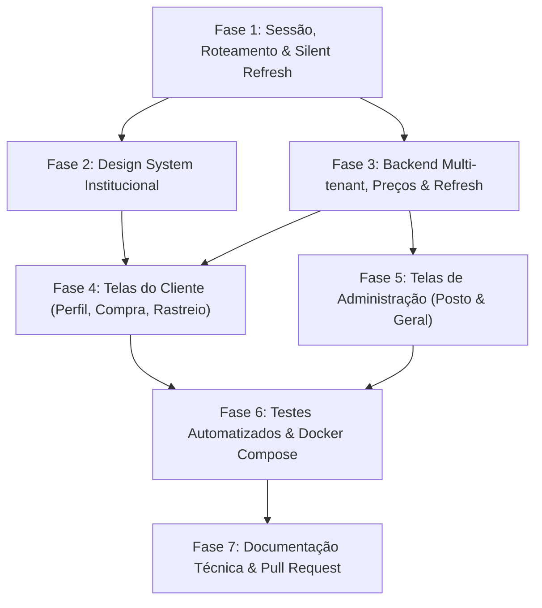

# PLANO DE TAREFAS DE IMPLEMENTAÇÃO (TASKS.MD)
## Integração Frontend-Backend e Refinamento Institucional (FuelSync)

---

## 📋 Sumário de Execução

- **Branch de Trabalho:** `feature/integracao-front-back` (a partir de `develop`)
- **Documento de Especificação Base:** [`spec.md`](spec.md)
- **Metodologia:** TDD (Test-Driven Development) com garantia de regressão zero (161 testes backend mantidos)
- **Critério Global de Pronto (DoD):**
  - Dados mockados 100% substituídos por chamadas HTTP reais à API REST (`/api/v1`)
  - Design institucional sóbrio (Poppins, sem gradientes, sem glassmorphism, sem iconografia decorativa, mobile-friendly)
  - Sessão e autenticação resilientes com *Silent Token Refresh* no Axios (sem expulsão em 401 recuperável)
  - Máquinas de estados oficiais (`OrderStatus` e `DeliveryStatus`) refletidas na interface
  - Preços de combustíveis cadastrados e mantidos exclusivamente pelo administrador do posto (`posto_admin`) com tabela relacional e histórico de auditoria
  - Orquestração contêinerizada validada com sucesso via `docker compose build --no-cache` e `docker compose up -d`

---

## 🗺️ Mapa de Dependência das Fases



---

## FASE 1: Sessão, Roteamento e Resiliência de Autenticação

### [x] TASK-1.1: Criação da Branch de Integração
- **Descrição:** Criar e publicar a branch de feature dedicada a partir da branch `develop` atualizada.
- **Comandos:**
  ```bash
  git checkout develop
  git pull origin develop
  git checkout -b feature/integracao-front-back
  git push -u origin feature/integracao-front-back
  ```
- **Critério de Aceitação:** Branch criada e rastreada no repositório remoto.

---

### [x] TASK-1.2: Correção do Roteamento e Proteção de Rotas
- **Arquivo Alvo:** [`frontend/src/routes/AppRoutes.jsx`](frontend/src/routes/AppRoutes.jsx)
- **Ações:**
  - Remover a exportação temporária de `AppRoutesTest` que dispensava a autenticação.
  - Reativar o wrapper `<ProtectedRoute>` para todas as páginas operacionais (`/`, `/perfil`, `/comprar`, `/rastreio`, `/enderecos`, `/posto/*`, `/admin/*`).
  - Implementar o componente `<PublicOnlyRoute>` para redirecionar usuários autenticados que acessam `/login` ou `/cadastro` diretamente para `/`.
  - Criar o componente `<RoleRoute allowedRoles={['cliente', 'posto_admin', 'admin_geral']}>` para segregação de acesso no frontend.
- **Critério de Aceitação:** Usuários deslogados não conseguem acessar rotas protegidas; usuários logados são redirecionados automaticamente para fora de telas de login.

---

### [x] TASK-1.3: Sincronização Síncrona de Logout e Limpeza de Sessão
- **Arquivos Alvo:**
  - [`frontend/src/context/AuthContext.js`](frontend/src/context/AuthContext.js)
  - [`frontend/src/context/AuthProvider.jsx`](frontend/src/context/AuthProvider.jsx)
  - [`frontend/src/pages/HomePage.jsx`](frontend/src/pages/HomePage.jsx)
- **Ações:**
  - Atualizar o método `logout()` para remover simultaneamente `fuel_sync_token`, `fuel_sync_refresh_token` e `fuel_sync_user` do `localStorage`.
  - Zerar os estados internos `token`, `user` e `isAuthenticated`.
  - Configurar navegação forçada imperativa para `/login` ao término da ação de logout.
- **Critério de Aceitação:** Ao clicar em "Sair da conta" na Sidebar ou Navbar, o usuário é imediatamente redirecionado para a tela de Login e a sessão local é zerada.

---

### [x] TASK-1.4: Implementação do Silent Token Refresh no Interceptor Axios
- **Arquivo Alvo:** [`frontend/src/services/api.js`](frontend/src/services/api.js)
- **Ações:**
  - Armazenar o `fuel_sync_refresh_token` no login.
  - Implementar fila de requisições pendentes (`failedQueue`) e flag de controle `isRefreshing`.
  - Ao capturar status 401 em chamadas autenticadas:
    - Se a rota for `/auth/login` ou `/auth/refresh`, rejeitar imediatamente.
    - Se a requisição contiver `_retry: true`, limpar o `localStorage` e redirecionar para `/login`.
    - Se for o primeiro 401, marcar `_retry: true`, setar `isRefreshing = true` e disparar `POST /api/v1/auth/refresh`.
    - Em caso de sucesso, salvar novos tokens, atualizar o cabeçalho padrão `Authorization: Bearer <newAccessToken>`, reexecutar a requisição original e resolver as promessas da `failedQueue`.
    - Em caso de falha no refresh, rejeitar a fila e redirecionar para `/login`.
- **Critério de Aceitação:** Quando o `accessToken` expira durante o preenchimento de formulários ou monitoramento, a requisição é renovada e reexecutada de forma transparente sem expulsar o operador.

---

## FASE 2: Design System Institucional e Responsividade (Enterprise)

### [x] TASK-2.1: Configuração Tipográfica e Fonte "Poppins"
- **Arquivos Alvo:**
  - [`frontend/index.html`](frontend/index.html)
  - [`frontend/tailwind.config.js`](frontend/tailwind.config.js)
  - [`frontend/src/index.css`](frontend/src/index.css)
- **Ações:**
  - Importar a família de fontes "Poppins" via Google Fonts (pesos 300, 400, 500, 600, 700).
  - Configurar `fontFamily: { sans: ['Poppins', 'sans-serif'] }` no Tailwind.
  - Definir escala tipográfica contida (títulos não ultrapassam 24px/32px; texto base 14px a 16px).
- **Critério de Aceitação:** Toda a aplicação renderiza uniformemente com a tipografia Poppins e escala corporativa.

---

### [x] TASK-2.2: Expurgar Anti-padrões de IA e Padronizar Paleta Sóbria
- **Arquivos Alvo:** Todos os arquivos em [`frontend/src/pages/`](frontend/src/pages/) e componentes de layout
- **Ações:**
  - **Eliminar Gradientes:** Substituir fundos em gradiente por cores sólidas neutras (`bg-gray-50`, `bg-white`, `bg-slate-900`).
  - **Eliminar Glassmorphism e Sombras Coloridas:** Remover classes `backdrop-blur-*`, `shadow-purple-500/*` e bordas iluminadas.
  - **Limitar Raio de Bordas:** Substituir `rounded-2xl` e `rounded-3xl` em containers de dados por `rounded-md` ou `rounded-lg` (máximo 6px a 8px).
  - **Paleta Institucional Neutra:** Adotar escala de cinzas de alto contraste (`#111827`, `#4B5563`, `#9CA3AF`, `#E5E7EB`) e azul corporativo sólido (`#1E40AF` / `#2563EB`).
  - **Zero Iconografia Decorativa:** Remover ícones colocados ao lado de títulos ou textos descritivos; preservar ícones estritamente para ações interativas ou badges funcionais de status.
- **Critério de Aceitação:** Interface visual limpa, corporativa, com densidade de dados equilibrada e aspecto sóbrio de ERP/Dashboard executivo.

---

### [x] TASK-2.3: Responsividade Estrita e Navegação Adaptável
- **Arquivos Alvo:**
  - [`frontend/src/pages/HomePage.jsx`](frontend/src/pages/HomePage.jsx)
  - Componentes de Sidebar e Navbar em todas as páginas
- **Ações:**
  - Aplicar `overflow-x: hidden` no container raiz e viewport.
  - Configurar container com scroll horizontal exclusivo (`overflow-x: auto`) para todas as tabelas de dados.
  - Implementar colapso da Sidebar corporativa para menu hambúrguer / gaveta superior (drawer) em telas menores que 768px.
  - Assegurar que botões, inputs e alvos de toque tenham altura mínima acessível de 40px a 44px.
- **Critério de Aceitação:** Usabilidade perfeita em telas compactas (320px–375px mobile) até monitores ultrawide (1440px+), sem scroll horizontal involuntário na página.

---

## FASE 3: Backend Multi-tenant, Catálogo Tarifário e Refresh Token

### [ ] TASK-3.1: Migração DDL de Preços com Trigger e Vínculo de Administradores
- **Arquivos Alvo:**
  - [`database/migrations/002_station_pricing_and_multi_tenant.sql`](database/migrations/002_station_pricing_and_multi_tenant.sql)
  - `scripts/runMigrations.js`
  - [`package.json`](package.json)
- **Ações:**
  - **DDL Relacional:**
    - Criar tabela `posto_administradores (id, usuario_id, posto_id, created_at, UNIQUE(usuario_id, posto_id))`.
    - Criar tabela `posto_combustiveis (id, posto_id, combustivel_id, preco_litro, estoque_litros, disponivel, atualizado_em, atualizado_por, UNIQUE(posto_id, combustivel_id))`.
    - Criar tabela de auditoria `historico_precos_combustivel (id, posto_combustivel_id, posto_id, combustivel_id, preco_anterior, preco_novo, alterado_em, alterado_por)`.
    - Criar índices de busca rápida (`idx_posto_admin_usuario`, `idx_posto_combustiveis_posto`, `idx_historico_precos_posto`).
  - **Automação via Trigger PostgreSQL (Item C):**
    - Criar function `trg_fn_log_historico_preco()` e trigger `trg_audit_preco_combustivel` disparada `AFTER INSERT OR UPDATE OF preco_litro ON posto_combustiveis`. Garante que qualquer alteração de preço (via API, batch ou banco) persista automaticamente no histórico com integridade transacional.
  - **Execução e Ordem de Subida no Docker (Item B):**
    - Criar script runner `scripts/runMigrations.js` e registrar o comando `"migrate": "node scripts/runMigrations.js"` no `package.json`.
    - **Comando Exato para o Ambiente de Desenvolvimento:**
      ```bash
      npm run migrate
      ```
      *(Alternativa direta via psql: `psql "$DATABASE_URL" -f database/migrations/002_station_pricing_and_multi_tenant.sql`)*.
    - **Estratégia de Testes vs. Banco:**
      - Testes automatizados do Jest rodam com mocks do Supabase (`jest.mock`), garantindo execução desacoplada e veloz.
      - Para execução integrada local ou com Docker Compose, a migração é aplicada no banco Supabase/PostgreSQL antes da subida dos containers com `npm run migrate`.
- **Critério de Aceitação:** DDL executado com sucesso no PostgreSQL/Supabase com trigger ativa e comando `npm run migrate` operacional.

---

### [ ] TASK-3.2: Suporte ao Papel `admin_geral` no Backend
- **Arquivos Alvo:**
  - [`src/common/constants/enums.js`](src/common/constants/enums.js)
  - [`src/common/middlewares/roleMiddleware.js`](src/common/middlewares/roleMiddleware.js)
- **Ações:**
  - Adicionar `ADMIN_GERAL: 'admin_geral'` no enum `UserRoles`.
  - Garantir que o `roleMiddleware` aceite o novo papel e permita que `admin_geral` execute ações restritas de cadastro de postos e entregadores globais.
- **Critério de Aceitação:** Constante registrada e validada em testes unitários.

---

### [ ] TASK-3.3: Endpoint de Renovação de Sessão (`POST /api/v1/auth/refresh`)
- **Arquivos Alvo:**
  - [`src/modules/auth/authService.js`](src/modules/auth/authService.js)
  - [`src/modules/auth/authController.js`](src/modules/auth/authController.js)
  - [`src/modules/auth/authRoutes.js`](src/modules/auth/authRoutes.js)
- **Ações:**
  - Implementar método `refreshToken({ refreshToken })` consumindo `supabase.auth.refreshSession`.
  - Retornar novo `accessToken`, `refreshToken` e dados do `user`.
  - Registrar rota `POST /api/v1/auth/refresh` com anotações OpenAPI/Swagger.
- **Critério de Aceitação:** Retorna 200 com novo JWT para refresh tokens válidos e 401 para expirados/inválidos.

---

### [ ] TASK-3.4: Endpoints de Precificação e Catálogo por Posto
- **Arquivos Alvo:**
  - [`src/modules/stations/stationService.js`](src/modules/stations/stationService.js)
  - [`src/modules/stations/stationController.js`](src/modules/stations/stationController.js)
  - [`src/modules/stations/stationRoutes.js`](src/modules/stations/stationRoutes.js)
- **Ações:**
  - `GET /api/v1/stations/:stationId/fuels`: Retorna os combustíveis ativos do posto com o `preco_litro` e disponibilidade.
  - `POST /api/v1/stations/:stationId/fuels`: Cadastra combustível no posto com preço inicial e estoque.
  - `PUT /api/v1/stations/:stationId/fuels/:combustivelId`: Atualiza `preco_litro`, estoque e disponibilidade em `posto_combustiveis`. **Nota de Arquitetura:** A inserção em `historico_precos_combustivel` é delegada integralmente à Trigger PostgreSQL criada na TASK-3.1, garantindo atomicidade e dispensando inserts manuais propensos a falhas.
  - `GET /api/v1/stations/:stationId/fuels/:combustivelId/history`: Retorna o histórico cronológico de reajustes tarifários gerado pela trigger.
  - Implementar middleware de validação multi-tenant garantindo que `posto_admin` só opere nos postos atribuídos a ele em `posto_administradores`.
- **Critério de Aceitação:** Permissões validadas com 403 para postos não autorizados e histórico persistido automaticamente via trigger do banco.

---

### [ ] TASK-3.5: Validação Antifraude de Preço no Pedido B2C
- **Arquivos Alvo:**
  - [`src/modules/orders/orderService.js`](src/modules/orders/orderService.js)
  - [`src/modules/orders/orderValidator.js`](src/modules/orders/orderValidator.js)
- **Ações:**
  - No fluxo de criação do pedido (`POST /api/v1/orders`), consultar a tabela `posto_combustiveis` para o `posto_id` informado.
  - Validar se cada `combustivel_id` está disponível no posto e se o `valor_unitario` do payload corresponde com fidelidade ao `preco_litro` vigente.
  - Recalcular subtotais e `valor_total` estritamente no servidor.
- **Critério de Aceitação:** Bloqueia pedidos com preços divergentes do catálogo do posto e impede fraude de valores pelo cliente.

---

## FASE 4: Integração das Páginas do Cliente com a API

### [ ] TASK-4.1: Integração de Login e Cadastro com Persistência Real
- **Arquivos Alvo:**
  - [`frontend/src/pages/auth/LoginPage.jsx`](frontend/src/pages/auth/LoginPage.jsx)
  - [`frontend/src/pages/auth/RegisterPage.jsx`](frontend/src/pages/auth/RegisterPage.jsx)
- **Ações:**
  - Conectar submissão de login à rota `POST /api/v1/auth/login`.
  - Armazenar `accessToken`, `refreshToken` e `user` no `localStorage`.
  - Redirecionar condicionalmente por papel: `cliente` $\to$ `/`, `posto_admin` $\to$ `/posto/pedidos`, `admin_geral` $\to$ `/admin/postos`.
  - Conectar cadastro de cliente à rota `POST /api/v1/auth/signup/customer` com validação de CPF e telefone.
- **Critério de Aceitação:** Fluxos de login e cadastro 100% integrados à API e persistidos no Supabase.

---

### [ ] TASK-4.2: Integração da Homepage Dinâmica do Cliente
- **Arquivo Alvo:** [`frontend/src/pages/HomePage.jsx`](frontend/src/pages/HomePage.jsx)
- **Ações:**
  - Consumir dados do usuário logado via `useAuth()`.
  - Consultar o último pedido ativo em andamento via `GET /api/v1/orders` e exibir card informativo resumido com status atual.
  - Apresentar atalhos corporativos diretos para *Comprar Combustível*, *Meus Pedidos* e *Locais de Entrega*.
- **Critério de Aceitação:** Exibe dados reais do cliente e o resumo do pedido ativo sem dados estáticos.

---

### [ ] TASK-4.3: Tela de Perfil e Dados Cadastrais (`/perfil`)
- **Arquivo Alvo:** `frontend/src/pages/PerfilPage.jsx`
- **Ações:**
  - Consumir `GET /customers` para recuperar dados do cliente vinculado ao `usuario_id`.
  - Formulário corporativo para atualizar Nome, Telefone, Endereço Padrão e Ponto de Referência Padrão (Marina, Píer, Vaga) via `PUT /customers/:id`.
  - Tratamento de estados de loading e toast/alerta de sucesso ou erro.
- **Critério de Aceitação:** Atualização do perfil reflete no banco de dados e alimenta os dados padrão de novos pedidos.

---

### [ ] TASK-4.4: Integração da Gestão de Endereços e Locais de Abastecimento (`/enderecos`)
- **Arquivo Alvo:** [`frontend/src/pages/EnderecosPage.jsx`](frontend/src/pages/EnderecosPage.jsx)
- **Ações:**
  - Eliminar arrays mockados em memória.
  - Implementar persistência dos locais frequentes de entrega utilizando as colunas de localização do cliente e histórico de pedidos.
  - Campos do formulário: Apelido do local, Tipo de Local (`tipo_local`: `MARINA`, `CONDOMINIO`, `CHACARA`, etc.), Endereço, Ponto de referência detalhado e Coordenadas Geográficas (Latitude e Longitude).
- **Critério de Aceitação:** Locais de entrega cadastrados podem ser selecionados diretamente na tela de compra.

---

### [ ] TASK-4.5: Integração da Tela de Compra com Preços do Posto (`/comprar`)
- **Arquivo Alvo:** [`frontend/src/pages/ComprarCombustivelPage.jsx`](frontend/src/pages/ComprarCombustivelPage.jsx)
- **Ações:**
  - Carregar lista de postos homologados via `GET /api/v1/stations`.
  - Ao selecionar um posto, carregar os combustíveis e preços por litro vigentes definidos pelo posto via `GET /api/v1/stations/:stationId/fuels`.
  - Exibir prévia do cálculo financeiro em tempo real ($\text{litros} \times \text{preço do posto}$).
  - Submeter o pedido completo via `POST /api/v1/orders` com o payload estrito (posto, endereço, tipo de local, coordenadas, ponto de referência e itens).
  - Redirecionar para `/rastreio` com o ID do pedido gerado.
- **Critério de Aceitação:** Pedido gravado no banco de dados nas tabelas `pedidos` e `itens_pedido` com os preços reais do posto.

---

### [ ] TASK-4.6: Integração da Tela de Rastreio com Máquina de Estados (`/rastreio`)
- **Arquivo Alvo:** [`frontend/src/pages/OrderTrackingPage.jsx`](frontend/src/pages/OrderTrackingPage.jsx)
- **Ações:**
  - Substituir o enum mockado (`ROTA`, `TRANSITO`, `ENTREGUE`) pelos status oficiais do backend (`PENDENTE`, `CONFIRMADO_POSTO`, `EM_PREPARACAO`, `EM_TRANSPORTE`, `CONCLUIDO`, `CANCELADO`).
  - Buscar pedidos do cliente via `GET /api/v1/orders` e detalhes via `GET /api/v1/orders/:id`.
  - Linha do tempo institucional refletindo a evolução real do ciclo logístico.
  - Exibir dados de telemetria e previsão da tabela `previsoes_ia` (ETA de entrega, confiança e mensagem).
  - Botão "Cancelar Pedido": Visível e acionável **exclusivamente** quando o status for `PENDENTE`, chamando `POST /api/v1/orders/:id/cancel`.
- **Critério de Aceitação:** Timeline sincronizada com o backend e cancelamento bloqueado após o início do preparo.

---

## FASE 5: Integração das Páginas de Administração (Posto & Geral)

### [ ] TASK-5.1: Dashboard de Pedidos Recebidos do Posto (`/posto/pedidos`)
- **Arquivo Alvo:** `frontend/src/pages/posto/PostoPedidosPage.jsx`
- **Ações:**
  - Listar pedidos atribuídos ao posto do administrador logado via `GET /api/v1/orders?posto_id=:id`.
  - Tabela densa corporativa com filtros por status (`PENDENTE`, `EM_PREPARACAO`, etc.) e busca por cliente/data.
  - Ações operacionais em modal objetivo ou inline para transição de status (`PATCH /api/v1/orders/:id/status`): Aceitar, Iniciar Preparo, Despachar e Concluir.
- **Critério de Aceitação:** O operador do posto avança o pedido pelas etapas logísticas com reflexo imediato no rastreio do cliente.

---

### [ ] TASK-5.2: Tela de Gestão de Preços e Catálogo do Posto (`/posto/catalogo`)
- **Arquivo Alvo:** `frontend/src/pages/posto/PostoCatalogoPage.jsx`
- **Ações:**
  - Carregar tipos de combustíveis e preços atuais do posto via `GET /api/v1/stations/:stationId/fuels`.
  - Tabela com campos editáveis: Preço por Litro (`preco_litro` com máscara monetária de 3 decimais), Estoque em Litros e Toggle de Disponibilidade.
  - Botão "Salvar Preço" que dispara `PUT /api/v1/stations/:stationId/fuels/:combustivelId`.
  - Modal secundário "Histórico de Reajustes" consumindo `GET /api/v1/stations/:stationId/fuels/:combustivelId/history`.
- **Critério de Aceitação:** Administrador do posto atualiza preços e o histórico de alterações é registrado com auditoria.

---

### [ ] TASK-5.3: Cadastro e Gestão de Entregadores do Posto (`/posto/entregadores`)
- **Arquivo Alvo:** `frontend/src/pages/posto/PostoEntregadoresPage.jsx`
- **Ações:**
  - Listar entregadores cadastrados no posto via `GET /api/v1/couriers?posto_id=:id`.
  - Formulário para credenciar novo entregador com vinculação ao posto via `POST /api/v1/auth/admin/create-courier`.
  - Atualização rápida de disponibilidade do entregador (`PATCH /api/v1/couriers/:id/status`).
- **Critério de Aceitação:** Entregador cadastrado com sucesso e vinculado à base operacional do posto.

---

### [ ] TASK-5.4: Gestão Geral de Postos e Vínculos (`/admin/postos`)
- **Arquivos Alvo:**
  - `frontend/src/pages/admin/AdminPostosPage.jsx`
  - `frontend/src/pages/admin/AdminVinculosPage.jsx`
- **Ações:**
  - Tela de cadastro de novos postos homologados via `POST /api/v1/stations` (restrita a `admin_geral`).
  - Edição de postos e ativação/inativação via `PUT /api/v1/stations/:id` e `PATCH /api/v1/stations/:id/status`.
  - Tela para associar usuários `posto_admin` aos postos físicos correspondentes (`posto_administradores`).
- **Critério de Aceitação:** Administrador Geral cadastra postos e delega permissões aos administradores locais.

---

## FASE 6: Testes Automatizados, Docker Build & Validação Ponta a Ponta

### [ ] TASK-6.1: Suíte de Testes Unitários e de Integração do Backend (Jest)
- **Arquivos Alvo:**
  - `tests/unit/stationPricing.test.js`
  - `tests/integration/stationPricingRoutes.test.js`
  - `tests/integration/authRefresh.test.js`
- **Ações:**
  - Cobrir validação de preços positivos, bloqueio de acesso a postos não vinculados e histórico de reajustes.
  - Cobrir endpoint de refresh token com cenários de sucesso e token expirado.
  - Executar a suíte completa de regressão: `npm test`.
- **Critério de Aceitação:** 100% de aprovação (mínimo 170+ testes passando sem nenhuma quebra).

---

### [ ] TASK-6.2: Suíte de Testes Unitários do Frontend (Vitest + Testing Library)
- **Arquivos Alvo:**
  - `frontend/src/services/__tests__/api.interceptors.test.js`
  - `frontend/src/pages/auth/__tests__/LoginPage.test.jsx`
  - `frontend/src/pages/__tests__/ComprarCombustivelPage.test.jsx`
  - `frontend/src/pages/__tests__/OrderTrackingPage.test.jsx`
  - `frontend/src/pages/posto/__tests__/PostoCatalogoPage.test.jsx`
- **Ações:**
  - Testar renovação silenciosa no interceptor do Axios com resposta 401 e enfileiramento na `failedQueue`.
  - Testar cálculo financeiro em tela e submissão com preços do posto selecionado.
  - Testar bloqueio de cancelamento em pedidos com status avançado na timeline de rastreio.
  - Testar máscara e validação de preço na tela de catálogo do posto.
  - Executar `npm --prefix frontend test`.
- **Critério de Aceitação:** Todas as suítes do frontend aprovadas com 100% de sucesso.

---

### [ ] TASK-6.3: Validação do Build Contêinerizado e Proxy Reverso com Docker
- **Arquivos Alvo:**
  - [`Dockerfile`](Dockerfile)
  - [`frontend/Dockerfile`](frontend/Dockerfile)
  - [`docker-compose.yml`](docker-compose.yml)
- **Ações:**
  - Aplicar migrações pendentes no banco de desenvolvimento antes da inicialização contêinerizada:
    ```bash
    npm run migrate
    ```
  - Executar build completo limpo dos containers:
    ```bash
    docker compose build --no-cache
    ```
  - Subir os containers e verificar logs:
    ```bash
    docker compose up -d
    ```
  - Validar a comunicação de rede na bridge `fuel-sync-network`:
    - Acesso ao frontend em `http://localhost:5173`.
    - Chamadas a `/api/v1/*` roteadas através do proxy do Vite para `http://backend:3000`.
    - Swagger acessível em `http://localhost:3000/api-docs`.
    - Hot reload ativo com `usePolling: true`.
- **Critério de Aceitação:** Ambos os containers ativos, saudáveis e integrados sem erros de CORS, com schema de banco sincronizado.

---

## FASE 7: Documentação Técnica, Revisão e Pull Request

### [ ] TASK-7.1: Atualização de Documentações dos Módulos
- **Arquivos Alvo:**
  - [`frontend/README.md`](frontend/README.md)
  - [`src/modules/stations/README.md`](src/modules/stations/README.md)
  - [`src/modules/auth/README.md`](src/modules/auth/README.md)
  - [`src/modules/orders/README.md`](src/modules/orders/README.md)
- **Ações:**
  - Registrar as regras de precificação por posto e histórico de auditoria.
  - Documentar os papéis RBAC (`cliente`, `posto_admin`, `entregador`, `admin_geral`).
  - Documentar o fluxo de *Silent Refresh* e endpoints adicionados.
- **Critério de Aceitação:** Documentações técnicas atualizadas e refletindo o estado final da aplicação.

---

### [ ] TASK-7.2: Atualização do `pr.md` e Submissão do Pull Request
- **Arquivos Alvo:**
  - [`pr.md`](pr.md)
- **Ações:**
  - Redigir descrição do Pull Request para a branch `feature/integracao-front-back`.
  - **Regra Estrita do PR:** Texto conciso, direto, sem emojis.
  - Enviar commits semânticos para o repositório remoto:
    ```bash
    git add .
    git commit -m "feat(integration): integrate frontend with backend, multi-tenant pricing and docker orchestration"
    git push -u origin feature/integracao-front-back
    ```
- **Critério de Aceitação:** Pull Request registrado no GitHub com descrição técnica completa e sem emojis.

---

## 📊 Matriz de Rastreabilidade (Requisitos $\to$ Tarefas)

| Requisito do `spec.md` | Tarefas Correspondentes | Camada |
| :--- | :--- | :--- |
| **Bug da Homepage & Logout** | TASK-1.2, TASK-1.3 | Frontend (Routes & AuthContext) |
| **Silent Refresh (Resiliência a 401)** | TASK-1.4, TASK-3.3, TASK-6.2 | Frontend (Axios) & Backend (Auth) |
| **Design System Institucional (Poppins, Anti-IA)** | TASK-2.1, TASK-2.2, TASK-2.3 | Frontend (Tailwind, Pages, UI) |
| **Multi-tenant de Postos (`posto_administradores`)** | TASK-3.1, TASK-3.4, TASK-5.4 | Banco de Dados & Backend |
| **Preços por Posto (`posto_combustiveis`)** | TASK-3.1, TASK-3.4, TASK-5.2 | Banco de Dados & Backend & Frontend |
| **Auditoria de Preços (`historico_precos`)** | TASK-3.1, TASK-3.4, TASK-5.2 | Banco de Dados & Backend |
| **Validação Antifraude de Preço no Pedido** | TASK-3.5, TASK-4.5 | Backend (Orders) & Frontend |
| **Máquina de Estados de Pedido e Entrega** | TASK-4.6, TASK-5.1 | Frontend (Tracking & Dashboard) |
| **Novo Papel `admin_geral`** | TASK-3.2, TASK-5.4 | Backend (RBAC) & Frontend (Admin) |
| **Build Contêinerizado com Docker Compose** | TASK-6.3 | DevOps / Docker |
| **Testes Automatizados (Regressão Zero)** | TASK-6.1, TASK-6.2 | Testes (Jest + Vitest) |
